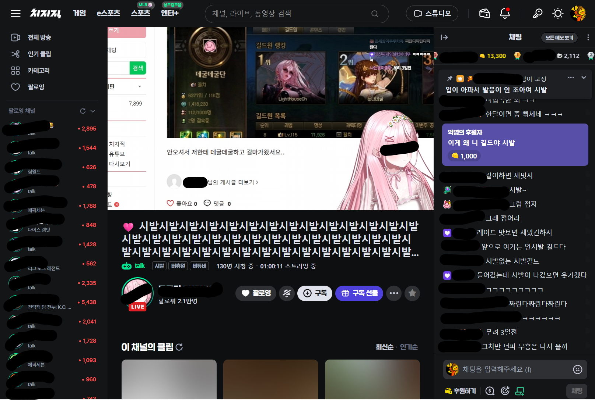

# CHZZK 데굴어 통역기

* **데굴**어를 통역합니다.
* 채팅 입력창은 건드리지 않으므로 안심하고 채팅하세요.

## Install

### STEP 1. ScriptManager

브라우저에 맞는 링크에서 Tampermonkey를 설치하세요.

* Chrome - [Tampermonkey](https://chrome.google.com/webstore/detail/tampermonkey/dhdgffkkebhmkfjojejmpbldmpobfkfo)
* Firefox - [Tampermonkey](https://addons.mozilla.org/ko/firefox/addon/tampermonkey/)
* Opera - [Tampermonkey](https://addons.opera.com/extensions/details/tampermonkey-beta/)
* Safari - [Tampermonkey](https://safari.tampermonkey.net/tampermonkey.safariextz)
* Edge - [Tampermonkey](https://microsoftedge.microsoft.com/addons/detail/tampermonkey/iikmkjmpaadaobahmlepeloendndfphd)

### STEP 2. UserScript

아래 링크를 클릭한 뒤, 뜨는 창에서 **설치** 버튼을 눌러 스크립트를 설치합니다.

* [https://github.com/nomomo/Chzzk\_Scripts/raw/main/CHZZK\_Degul\_Interpreter/CHZZK\_Degul\_Interpreter.user.js](https://github.com/nomomo/Chzzk_Scripts/raw/main/CHZZK_Degul_Interpreter/CHZZK_Degul_Interpreter.user.js)

설치는 여기까지입니다. 즐겁게 사용하세요!

> **주의:** 본 스크립트 사용 중 발생하는 브라우저 과부하, 응답 없음, 데이터 손실 등 문제에 대해 개발자는 책임지지 않습니다.
> 2025년 8월 16일 기준으로 채팅에서 문제가 없는 것은 확인했지만, 치지직 레이아웃 업데이트 등에 따라 번역된 내용이 그대로 전송되는 사고가 발생할 수 있음. **번역된 내용이 채팅이나 댓글 등으로 입력되어 발생하는 사고에 대해서 책임지지 않음.**
> Tampermonkey 외 스크립트 매니저에서는 정상 동작하지 않을 수 있습니다.

## Note

- 코드의 90% 이상을 ChatGPT로 작성했어요. 성능 이슈가 있을 수도 있는데 대충 잘 되는 것 같아요. 문제가 생기면 스크립트를 비활성화 하세요.

## Changelog

### 0.0.1 — Aug. 16, 2025

* 첫 커밋

## License

MIT

## Support

