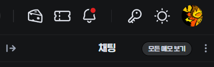

# CHZZK User Memo (Alpha Version)

> **[공지] 테스트 버전이므로 별도 공지 없이 기능이 수정되거나 스크립트가 삭제될 수 있습니다.**

- 치지직 채팅창에 유저 메모 기능을 추가합니다.
- 악질 및 분탕 유저에 대한 관리 및 신고를 위한 목적으로 개발되었어요.
- 누군가를 스토킹하는데 사용하지 않길 바라요!

## Preview

- 메모가 존재하는 유저의 경우 닉네임 우측에 사용자가 설정한 별명을 표시해요.
- 메모는 유저마다 고유한 UID를 기반으로 저장되므로, 닉네임이 변경되어도 유지돼요.
- 사용자 이름을 클릭한 후 메모하기 버튼을 누르면 메모를 추가할 수 있어요.
- 닉변 로그 또는 채팅 로그가 있는 경우 이를 확인하기 위한 버튼이 표시돼요. (추적 기능이 켜져있을 때)

### 메모 추가

- 메모하기 버튼을 누르면 메모를 추가할 수 있어요.
- 채팅창에 표시할 사용자 별명과, 상세 메모를 작성할 수 있어요.
- 추적하기에 체크하는 경우, 채팅 로그와 닉변 로그를 저장해요.

### UID 복사

- 채팅 가장 우측의 복사 버튼을 클릭하면 현재 닉네임, UID, 채팅 내용, 채팅 시간을 클립보드에 복사해요.

### 닉변 알림

- 메모 되어있는 유저가 닉변한 후 채팅을 칠 때 알려줘요요.

### 메모 확인

- 모든 메모 보기 버튼을 클릭하여 메모된 내용을 볼 수 있어요.

### 설정

- 유저별 채팅과 닉변 로그를 저장할 개수를 설정할 수 있어요.
- 로그가 지정된 수를 초과하는 경우 가장 오래된 것부터 삭제돼요.
- 기본 값은 채팅 기록 30개, 닉변 기록 5개에요. 로그를 너무 많이 남기면 느려질 수도 있어요.

## Install

설치 방법을 설명합니다.

### STEP 1. ScriptManager

아래 리스트에서 본인이 사용 중인 브라우저에 맞는 링크에 접속한 후, 유저스크립트 관리 확장기능인 Tampermonkey 를 설치하세요.

- Chrome - [Tampermonkey](https://chrome.google.com/webstore/detail/tampermonkey/dhdgffkkebhmkfjojejmpbldmpobfkfo)
- Firefox - [Tampermonkey](https://addons.mozilla.org/ko/firefox/addon/tampermonkey/)
- Opera - [Tampermonkey](https://addons.opera.com/extensions/details/tampermonkey-beta/)
- Safari - [Tampermonkey](https://safari.tampermonkey.net/tampermonkey.safariextz)
- Edge - [Tampermonkey](https://microsoftedge.microsoft.com/addons/detail/tampermonkey/iikmkjmpaadaobahmlepeloendndfphd)

### STEP 2. UserScript

- 유저스크립트 관리 확장기능 설치 후 아래의 링크를 클릭하세요. 이후 뜨는 창에서 "설치" 버튼을 눌러 스크립트를 설치합니다.
  - [https://github.com/nomomo/Chzzk_Scripts/raw/main/CHZZK_User_Memo/CHZZK_User_Memo.user.js](https://github.com/nomomo/Chzzk_Scripts/raw/main/CHZZK_User_Memo/CHZZK_User_Memo.user.js)

이것으로 설치는 끝입니다. 즐겁게 사용하세요~

> 주의: 본 스크립트를 설치 및 사용하며 브라우저 과부하로 인한 응답 없음/뻗음으로 인한 데이터 손실이나 기타 발생하는 다른 문제에 대하여 개발자는 책임지지 않음(보고된 문제는 없음)  
> 본 스크립트는 Tampermonkey 외의 스크립트 매니저에서는 정상 동작하지 않을 수 있습니다.

## Note

- 코드의 80% 이상을 ChatGPT로 작성했어요. 예외처리 같은 것이 제대로 안 되어 있긴 한데 현재는 대충 잘 되는 것 같아요. 문제가 생기면 스크립트를 비활성화 하세요.
- 수초마다 닉변하면서 닌자 분신술을 펼치며 분탕칠을 치는 녀석이 있어서 만들었어요.

### 0.0.2 - Dec. 7, 2024

- 채팅에서 닉네임 클릭 시 UID가 출력되지 않는 문제 수정

### 0.0.1 - Aug. 16, 2024

- 최초 커밋 (Alpha 버전)

## License

MIT

## Happy??

