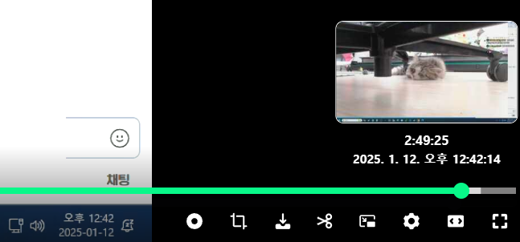

# CHZZK Video RealTime

- 이 스크립트는 CHZZK 다시보기 비디오의 슬라이더 바에 마우스를 올렸을 때, 비디오의 실제 시간을 표시해줍니다.
- 동작 원리: 서버에서 가져온 다시보기의 라이브 시작 시간에 현재 마우스가 가리키는 시점의 동영상 시간을 더하여 계산된 시간을 표시합니다.

## Preview

## 설치

아래 단계를 따라 UserScript를 설치하세요.

### STEP 1. ScriptManager

먼저 아래 링크에서 본인이 사용 중인 브라우저에 맞는 Tampermonkey 확장 프로그램을 설치하세요.

- Chrome - [Tampermonkey](https://chrome.google.com/webstore/detail/tampermonkey/dhdgffkkebhmkfjojejmpbldmpobfkfo)
- Firefox - [Tampermonkey](https://addons.mozilla.org/ko/firefox/addon/tampermonkey/)
- Opera - [Tampermonkey](https://addons.opera.com/extensions/details/tampermonkey-beta/)
- Safari - [Tampermonkey](https://safari.tampermonkey.net/tampermonkey.safariextz)
- Edge - [Tampermonkey](https://microsoftedge.microsoft.com/addons/detail/tampermonkey/iikmkjmpaadaobahmlepeloendndfphd)

### STEP 2. UserScript

Tampermonkey 확장 프로그램 설치 후, 아래 링크를 클릭하세요. 팝업 창에서 "설치" 버튼을 눌러 스크립트를 설치합니다.

- [https://github.com/nomomo/Chzzk_Scripts/raw/main/CHZZK_Video_RealTime/CHZZK_Video_RealTime.user.js](https://github.com/nomomo/Chzzk_Scripts/raw/main/CHZZK_Video_RealTime/CHZZK_Video_RealTime.user.js)

설치는 여기까지입니다. 즐겁게 사용하세요~

> 주의: 본 스크립트를 설치 및 사용하며 발생하는 브라우저 과부하로 인한 응답 없음, 뻗음으로 인한 데이터 손실이나 기타 문제에 대해 개발자는 책임지지 않습니다(보고된 문제는 없음).  
> 본 스크립트는 Tampermonkey 외의 스크립트 매니저에서는 정상 동작하지 않을 수 있습니다.

## 참고사항

- 다시보기 비디오에 싱크 문제가 있거나 서버에서 가져오는 라이브 시작 시간에 문제가 있는 경우 표시되는 시간이 실제 시간과 다를 수 있으므로 참고 용으로만 사용하세요.
- 라이브 시간이 길어 다시보기가 자동으로 잘린 경우 해당 라이브의 모든 다시보기는 동일한 라이브 시작 시간을 가집니다. 스크립트는 이전 다시보기의 정보를 체크하여 현재 보고있는 다시보기가 이전 다시보기에서 이어지는 것인지를 판단하고, 이를 고려하여 실제 시간을 계산합니다.
  - 만약 일부 다시보기가 숨겨진 경우 실제 시간이 잘못 계산될 수 있습니다.
- 코드의 90% 이상을 ChatGPT로 작성했습니다. 비효율적인 부분이 있고 예외 처리가 제대로 되어 있지는 않지만 현재는 대체로 잘 동작합니다. 문제가 생기면 스크립트를 비활성화하세요.

### 0.0.1 - Jan 13, 2025

- 최초 커밋

## 라이선스

MIT

## 후원하기

